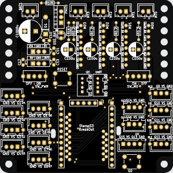
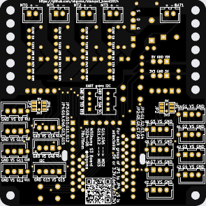

# M5Stamp S3用拡張基板 2024年版

## 概要

+ M5Stamp S3をXH/groveコネクタで使うための基板の2024年版。
+ 以下の利用を想定。
  - [M5StampS3 （1.27 mmピッチピンヘッダ実装済）](https://www.switch-science.com/products/9176)
    - 全ピンにアクセスできるよう1.27mmピッチを使用する。
  - [M5Stamp S3用ピッチ変換基板](https://www.switch-science.com/products/9178)
    - 拡張基板側に1.27mmピッチのピンヘッダ用パターンもあるが変換基板の利用を勧める。
  - StampS3ピンアサイン
    |pin  |備考     |pin  |備考
    |:--- |:---     |:--- |:---
    |G1   |
    |G2   |
    |G3   |
    |G4   |  
    |G5   |
    |G6   |
    |G7   |         |3V3  |
    |G8   |         |G46  |MT2_INA
    |G9   |         |G43  |TXC
    |G10  |         |G42  |MT1_INB
    |GND  |         |G44  |RXD
    |G11  |MT3_INB  |G41  |MT1_INA
    |5V   |         |EN   |
    |G12  |MT3_INB  |G40  |MT0_INB
    |G13  |SDA      |G0   |SW
    |G14  |MT2_INB  |G39  |MT0_INA
    |G15  |SCL      |GND  |
+ 利用するモーター数でADCポート数が変わる。
  - モーター 2個
    - ADC 14個(G1-12,14,46)
    - 各INA, INB　MT0：G39,G40　MT1：G40,G41
  - モーター 3個
    - ADC 12個(G1-12)
    - 各INA, INB　MT0：G39,G40　MT1：G40,G41　MT2：G46,G14
  - モーター 4個
    - ADC 10個(G1-10)
    - 各INA, INB　MT0：G39,G40　MT1：G40,G41　MT2：G46,G14　MT3：G11,G12
+ その他
  - ADCポートVSはデフォルト3ピンXH（pin,VS,GND）想定で、VSは標準で3.3V
  - VSは以下のグループ単位で3.3V/5Vを選択できる。
    - G1-G4
    - G5-G8
    - G9-12
    - G14,G46, (XH)G13,G15
  - G0 は本体スイッチと拡張基板上スイッチで共用
  - I2CのG13,G15はピッチ変換基板・拡張基板上のgrove、XH(TJ3B互換配置)コネクタで共用
    - XHのVSは選択(3.3V/5V)
    - grove は 5V固定
  - UARTのG44（ホストRX、デバイスTX）,G43（ホストTX、デバイスRX）は拡張基板上のgroveコネクタへ

+ モータードライバTB67H450FNG搭載のモジュール「[AE-TB67H450](https://akizukidenshi.com/catalog/g/gK-14753/)」を最大４個搭載可能。
  + [TB67H450FNG日本語データシート](https://toshiba.semicon-storage.com/info/TB67H450FNG_datasheet_ja_20201126.pdf?did=65345&prodName=TB67H450FNG)
  + 全モータードライバ出力の有効/無効の切替トグルスイッチ

+ 基板サイズ　78 x 78mm、周囲の穴は3.2mm径、5mm間隔
  + [タミヤ ユニバーサルプレート](https://www.tamiya.com/japan/products/70172/index.html)上に取り付け可能。

### Mega 2560 Rev3, Due, GIGA R1 WiFi の違い

+ [Mega 2560 Rev3](https://docs.arduino.cc/hardware/mega-2560)
+ [Due](https://docs.arduino.cc/hardware/due)
+ [GIGA R1 WiFi](https://docs.arduino.cc/hardware/giga-r1-wifi)

| 　　 | Mega | Due | GIGA | M5Stamp S3
| ---- | ---- | ---- | ---- | ----
| CPU | ATmega2560 | AT91SAM3X8E | STM32H747XI | ESP32-S3FN8
| クロック速度 | 16 MHz | 84MHz | 主コア 480MHz 副コア 240MHz | 最高240MHz
| メモリ | 8KB SRAM 256KB flash | 96KB SRAM 512KB flash | 1MB RAM 2MB Flash | 512KB 8MB flash
| USBコネクタ | USB-B | micro USB | USB-C | USB-C
| VIN | 7～12V | 7～12V | 6～24V | 5V
| デジタル入出力 | 54 | 54 | 76 | 
| アナログ入力 | 16 | 12 | 12 | 15
| アナログ出力(DAC) | 0 | 2 | 2 | 0
| PWM出力 | 15 | 12 | 12 | 
| 動作電圧 | 5V | 3.3V | 3.3V | 5V
| 1 I/Oピンの最大出力電流 | 20mA | 9mA or 3mA | 8mA | 1500mA
| 全I/Oピンの合計最大出力電流 | ※ | 130mA | -- | -- 

+ [ESP32-S3 Series Datasheet](https://www.espressif.com/sites/default/files/documentation/esp32-s3_datasheet_en.pdf)
+ [ESP32-S3 Technical Reference Manual](https://www.espressif.com/sites/default/files/documentation/esp32-s3_technical_reference_manual_en.pdf)

## サンプルなど
+ 準備中

## マニュアル
+ 準備中

## 実装例
+ 準備中

### パーツリスト

+ 準備中
 
## 購入先

+ [スイッチ・サイエンス](https://www.switch-science.com/)
+ [秋月電子](https://akizukidenshi.com/catalog/)

## 回路図

- モータードライバ周りはアプリケーションノートに従った。
  - [TB67H450FNGアプリケーションノート](https://akizukidenshi.com/download/ds/toshiba/TB67H450FNG_application_note_ja_20190510.pdf)

## 基板作成

+ [KiCAD7](https://www.kicad.org/)で設計し、基板作成まで行った。
  + コネクタは表・裏どちらにも実装し易いよう、フットプリントで両面にシルクを入れた。
  + センサ用ポートはXHコネクタ3ピン想定だが、4ピンのXHもしくはgroveコネクタも使えるようにした。
  + 参考書　 「[KiCad 7 入門実習テキスト『KiCad Basics for 7.0』（ダウンロード商品）](https://booth.pm/ja/items/4560998)」
+ 基板作成は「[JLCPCB](https://jlcpcb.com/)」を利用した。
  + つや消し黒が安い。
  + 2024-06-19発注、2024-06-XX到着運。送便はOCS Expressを選択
  + twitter https://twitter.com/JLCPCB_Japan
+ [発注時ガーバーファイル](./pcb/stamps3_board_202406)

----

2024-06-25 ohguma 初版